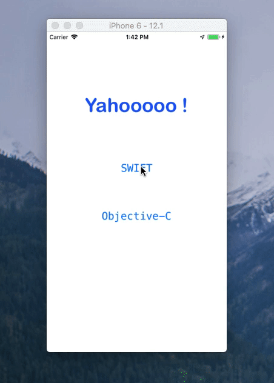

# yahooOAuthiOS
An illustration of OAuth Signature call for Yahoo Weather written in Swift and Objective-C.

The example code give by yahoo is written in Java, PHP and Node.js. If you need to port it in Swift/Objective-C you can use this.

# Swift
OAuthSwit.swift 

# Objective-C
OauthObjectiveC.h
OauthObjectiveC.m
